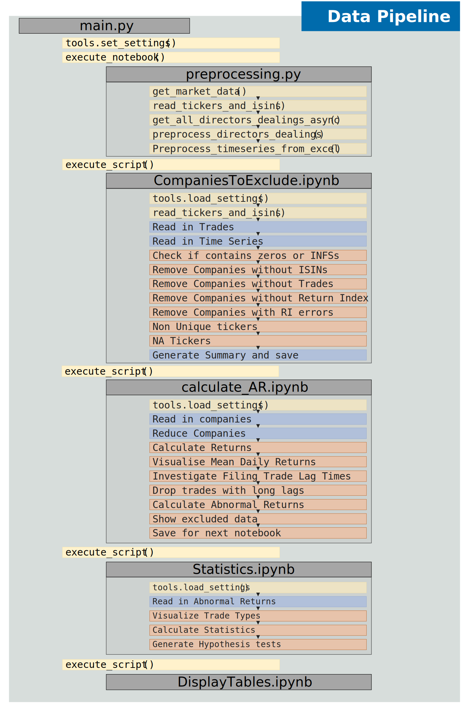

# Interdisciplinary Project: Performance of Directors' Dealings Transaction in Shares of NASDAQ and NYSE Composite Companies pre vs during Covid 19 Pandemic
_Written by Thomas Niedermayer and Gunnar Sjúrðarson Knudsen, as a conjoined effort for an interdisciplinary project in Data Science._
* Supervisor: a.o. Univ.-Prof. Dr. Wolfgang Aussenegg
* Co-Supervisor: Associate Prof. Dipl.-Inform. Dr.rer.nat. Sascha Hunold
* Domain-specific lecture: 330.214 Project and Enterprise

## Goal
Directors dealings are legal, but required to be disclosed. As there is a risk of directors acting on non-public knowledge, the hypothesis is that these transactions can effect the companies stock price. We aim to investigate to which extend directors dealings have effected the stock prices of NASDAQ companies, and whether this behaviour has changed during the times of Covid.

This repository implements the adjusted BMP / standardized cross-sectional test and the GRANK / generalized rank t test.

### Hypotheses / Goals

#### Gunnar Knudsen:
1. Insiders are able to earn significant abnormal returns in the first weeks after disclosure
2. Trades of type "Purchase" are most explaining of abnormal return. "Sale" less so, and "Sale + Option" does not have an effect.
3. Directors have changed behaviour during the times of Covid.

#### Thomas Niedermayer:
1. Insiders are able to earn significant abnormal returns in the first weeks after disclosure of relevant information
2. Insiders are significantly good at avoiding risk indicated by market downturns after insiders selling shares.
3. Directors have changed behaviour during the times of covid: The average abnormal returns per day significantly changed in the pandemic compared to pre-pandemic times.

## Prerequisites
In order to reproduce the analysis, a list of companies to be analysed should be found in `input_data\{name}`, together with the Return Index.

## Usage
Modify `main.py` to set which analysis should be ran. then run the entire pipeline with `python main.py`.

## Data pipeline 



## System Description
For reproducability, We've attached a full description of the system where this was run:

### System
````{verbatim}
(intDisp) C:\Users\waxfa>systeminfo
Host Name:                 DESKTOP-09UDM4V
OS Name:                   Microsoft Windows 11 Pro
OS Version:                10.0.22000 N/A Build 22000
OS Manufacturer:           Microsoft Corporation
OS Configuration:          Standalone Workstation
OS Build Type:             Multiprocessor Free
Registered Organization:
Product ID:                00330-52907-79070-AAOEM
Original Install Date:     31/07/2022, 13:01:26
System Boot Time:          10/11/2022, 01:46:02
System Manufacturer:       LENOVO
System Model:              20QN0034MX
System Type:               x64-based PC
Processor(s):              1 Processor(s) Installed.
                           [01]: Intel64 Family 6 Model 158 Stepping 13 GenuineIntel ~2592 Mhz
BIOS Version:              LENOVO N2NET49W (1.34 ), 14/10/2021
Windows Directory:         C:\WINDOWS
System Directory:          C:\WINDOWS\system32
Boot Device:               \Device\HarddiskVolume1
System Locale:             en-gb;English (United Kingdom)
Input Locale:              da;Danish
Time Zone:                 (UTC+01:00) Amsterdam, Berlin, Bern, Rome, Stockholm, Vienna
Total Physical Memory:     130.773 MB
Available Physical Memory: 100.859 MB
Virtual Memory: Max Size:  150.229 MB
Virtual Memory: Available: 114.427 MB
Virtual Memory: In Use:    35.802 MB
Domain:                    WORKGROUP
Hotfix(s):                 5 Hotfix(s) Installed.
                           [01]: KB5020617
                           [02]: KB5007575
                           [03]: KB5012170
                           [04]: KB5019961
                           [05]: KB5017850
Hyper-V Requirements:      VM Monitor Mode Extensions: Yes
                           Virtualization Enabled In Firmware: Yes
                           Second Level Address Translation: Yes
                           Data Execution Prevention Available: Yes
````

### Python
````{verbatim}
(base) C:\Users\waxfa>python --version
Python 3.9.12
````

### Package Versions
````{verbatim}
(intDisp) C:\Users\waxfa>conda list
# packages in environment at C:\Users\waxfa\.conda\envs\intDisp:
#
# Name                    Version                   Build  Channel
absl-py                   1.2.0              pyhd8ed1ab_0    conda-forge
aiohttp                   3.8.1            py39hb82d6ee_1    conda-forge
aiosignal                 1.2.0              pyhd8ed1ab_0    conda-forge
anyio                     3.6.1              pyhd8ed1ab_1    conda-forge
argon2-cffi               21.3.0             pyhd8ed1ab_0    conda-forge
argon2-cffi-bindings      21.2.0           py39hb82d6ee_2    conda-forge
arrow                     1.2.3                    pypi_0    pypi
asttokens                 2.0.8              pyhd8ed1ab_0    conda-forge
async-timeout             4.0.2              pyhd8ed1ab_0    conda-forge
attrs                     22.1.0             pyh71513ae_1    conda-forge
babel                     2.10.3             pyhd8ed1ab_0    conda-forge
backcall                  0.2.0              pyh9f0ad1d_0    conda-forge
backports                 1.0                        py_2    conda-forge
backports.functools_lru_cache 1.6.4              pyhd8ed1ab_0    conda-forge
beautifulsoup4            4.11.1             pyha770c72_0    conda-forge
blas                      1.0                         mkl
bleach                    5.0.1              pyhd8ed1ab_0    conda-forge
blinker                   1.4                        py_1    conda-forge
bottleneck                1.3.5            py39h080aedc_0
brotli                    1.0.9                h2bbff1b_7
brotli-bin                1.0.9                h2bbff1b_7
brotlipy                  0.7.0           py39hb82d6ee_1004    conda-forge
c-ares                    1.18.1               h8ffe710_0    conda-forge
ca-certificates           2022.4.26            haa95532_0    anaconda
cachetools                5.2.0              pyhd8ed1ab_0    conda-forge
certifi                   2022.6.15        py39haa95532_0    anaconda
cffi                      1.15.1           py39h0878f49_0    conda-forge
charset-normalizer        2.1.1              pyhd8ed1ab_0    conda-forge
click                     8.1.3            py39hcbf5309_0    conda-forge
cloudpickle               2.2.0                    pypi_0    pypi
cmake                     3.24.1.1                 pypi_0    pypi
colorama                  0.4.5              pyhd8ed1ab_0    conda-forge
cryptography              37.0.4           py39h7bc7c5c_0    conda-forge
cudatoolkit               11.3.1               h59b6b97_2
cycler                    0.11.0             pyhd3eb1b0_0
cython                    0.29.32                  pypi_0    pypi
debugpy                   1.6.3            py39h415ef7b_0    conda-forge
decorator                 5.1.1              pyhd8ed1ab_0    conda-forge
defusedxml                0.7.1              pyhd8ed1ab_0    conda-forge
distro                    1.7.0                    pypi_0    pypi
dm-tree                   0.1.7                    pypi_0    pypi
docker                    6.0.0                    pypi_0    pypi
docstring-parser          0.8.1                    pypi_0    pypi
entrypoints               0.4                pyhd8ed1ab_0    conda-forge
et_xmlfile                1.1.0            py39haa95532_0    anaconda
eventstudystatistics      1.0.2                    pypi_0    pypi
exceptiongroup            1.0.0rc9                 pypi_0    pypi
exchange-calendars        3.6.3              pyhd8ed1ab_0    conda-forge
executing                 1.0.0              pyhd8ed1ab_0    conda-forge
filelock                  3.8.0                    pypi_0    pypi
flit-core                 3.7.1              pyhd8ed1ab_0    conda-forge
fonttools                 4.25.0             pyhd3eb1b0_0
freetype                  2.10.4               hd328e21_0
frozenlist                1.3.1            py39hb82d6ee_0    conda-forge
fsspec                    2022.8.2           pyhd8ed1ab_0    conda-forge
future                    0.18.2           py39haa95532_1
gin-config                0.5.0                    pypi_0    pypi
git                       2.34.1               haa95532_0    anaconda
glib                      2.69.1               h5dc1a3c_1
google-auth               2.12.0             pyh1a96a4e_0    conda-forge
google-auth-oauthlib      0.4.6              pyhd8ed1ab_0    conda-forge
grpc-cpp                  1.48.1               h535cfc9_1    conda-forge
grpcio                    1.48.1           py39h7aa6313_1    conda-forge
gst-plugins-base          1.18.5               h9e645db_0
gstreamer                 1.18.5               hd78058f_0
gym                       0.23.0                   pypi_0    pypi
gym-notices               0.0.8                    pypi_0    pypi
hypothesis                6.56.0                   pypi_0    pypi
icc_rt                    2019.0.0             h0cc432a_1    anaconda
icu                       58.2                 ha925a31_3
idna                      3.3                pyhd8ed1ab_0    conda-forge
importlib-metadata        4.11.4           py39hcbf5309_0    conda-forge
importlib_metadata        4.11.4               hd8ed1ab_0    conda-forge
importlib_resources       5.9.0              pyhd8ed1ab_0    conda-forge
intel-openmp              2021.4.0          haa95532_3556
iopath                    0.1.10                   pypi_0    pypi
ipykernel                 6.15.3             pyh025b116_0    conda-forge
ipython                   8.5.0              pyh08f2357_1    conda-forge
ipython_genutils          0.2.0                      py_1    conda-forge
ipywidgets                7.6.5              pyhd3eb1b0_1    anaconda
jedi                      0.18.1             pyhd8ed1ab_2    conda-forge
jinja2                    3.1.2              pyhd8ed1ab_1    conda-forge
joblib                    1.1.0              pyhd3eb1b0_0
jpeg                      9e                   h2bbff1b_0
json5                     0.9.5              pyh9f0ad1d_0    conda-forge
jsonschema                4.16.0             pyhd8ed1ab_0    conda-forge
jupyter_client            7.3.5              pyhd8ed1ab_0    conda-forge
jupyter_core              4.11.1           py39hcbf5309_0    conda-forge
jupyter_server            1.18.1             pyhd8ed1ab_0    conda-forge
jupyterlab                3.4.7              pyhd8ed1ab_0    conda-forge
jupyterlab_pygments       0.2.2              pyhd8ed1ab_0    conda-forge
jupyterlab_server         2.15.1             pyhd8ed1ab_0    conda-forge
jupyterlab_widgets        1.0.0              pyhd3eb1b0_1    anaconda
jupyterthemes             0.20.0                     py_1    conda-forge
kiwisolver                1.4.2            py39hd77b12b_0
korean_lunar_calendar     0.3.1              pyhd8ed1ab_0    conda-forge
lerc                      3.0                  hd77b12b_0
lesscpy                   0.15.0             pyhd8ed1ab_0    conda-forge
libabseil                 20220623.0      cxx17_h1a56200_4    conda-forge
libbrotlicommon           1.0.9                h2bbff1b_7
libbrotlidec              1.0.9                h2bbff1b_7
libbrotlienc              1.0.9                h2bbff1b_7
libclang                  12.0.0          default_h627e005_2
libdeflate                1.8                  h2bbff1b_5
libffi                    3.4.2                hd77b12b_4
libiconv                  1.16                 he774522_0    conda-forge
libogg                    1.3.5                h2bbff1b_1
libpng                    1.6.37               h2a8f88b_0
libprotobuf               3.21.7               h12be248_0    conda-forge
libsodium                 1.0.18               h8d14728_1    conda-forge
libtiff                   4.4.0                h8a3f274_0
libuv                     1.40.0               he774522_0
libvorbis                 1.3.7                he774522_0
libwebp                   1.2.2                h2bbff1b_0
libxml2                   2.9.14               hf5bbc77_4    conda-forge
libxslt                   1.1.35               h34f844d_0    conda-forge
libzlib                   1.2.12               h8ffe710_2    conda-forge
lxml                      4.9.1            py39hb82d6ee_0    conda-forge
lz4-c                     1.9.3                h2bbff1b_1
markdown                  3.4.1              pyhd8ed1ab_0    conda-forge
markupsafe                2.1.1            py39hb82d6ee_1    conda-forge
matplotlib                3.5.2            py39haa95532_0
matplotlib-base           3.5.2            py39hd77b12b_0
matplotlib-inline         0.1.6              pyhd8ed1ab_0    conda-forge
mistune                   2.0.4              pyhd8ed1ab_0    conda-forge
mkl                       2021.4.0           haa95532_640
mkl-service               2.4.0            py39h2bbff1b_0
mkl_fft                   1.3.1            py39h277e83a_0
mkl_random                1.2.2            py39hf11a4ad_0
multidict                 6.0.2            py39hb82d6ee_1    conda-forge
munkres                   1.1.4                      py_0
mypy-extensions           0.4.3                    pypi_0    pypi
nbclassic                 0.4.3              pyhd8ed1ab_0    conda-forge
nbclient                  0.6.8              pyhd8ed1ab_0    conda-forge
nbconvert                 7.0.0              pyhd8ed1ab_0    conda-forge
nbconvert-core            7.0.0              pyhd8ed1ab_0    conda-forge
nbconvert-pandoc          7.0.0              pyhd8ed1ab_0    conda-forge
nbformat                  5.5.0              pyhd8ed1ab_0    conda-forge
nest-asyncio              1.5.5              pyhd8ed1ab_0    conda-forge
ninja                     1.10.2.4                 pypi_0    pypi
ninja-base                1.10.2               h6d14046_5
notebook                  6.4.12             pyha770c72_0    conda-forge
notebook-shim             0.1.0              pyhd8ed1ab_0    conda-forge
numexpr                   2.8.3            py39hb80d3ca_0
numpy                     1.22.4                   pypi_0    pypi
oauthlib                  3.2.1              pyhd8ed1ab_0    conda-forge
openpyxl                  3.0.9              pyhd3eb1b0_0    anaconda
openssl                   1.1.1q               h2bbff1b_0
packaging                 21.3               pyhd8ed1ab_0    conda-forge
pandas                    1.4.3            py39hd77b12b_0
pandas_market_calendars   4.0                pyhd8ed1ab_0    conda-forge
pandoc                    2.19.2               h57928b3_0    conda-forge
pandocfilters             1.5.0              pyhd8ed1ab_0    conda-forge
parso                     0.8.3              pyhd8ed1ab_0    conda-forge
patsy                     0.5.2            py39haa95532_1    anaconda
pcre                      8.45                 hd77b12b_0
pickleshare               0.7.5                   py_1003    conda-forge
pillow                    9.2.0            py39hdc2b20a_1
pip                       22.1.2           py39haa95532_0
pkgutil-resolve-name      1.3.10             pyhd8ed1ab_0    conda-forge
ply                       3.11             py39haa95532_0
portalocker               2.5.1                    pypi_0    pypi
prometheus_client         0.14.1             pyhd8ed1ab_0    conda-forge
prompt-toolkit            3.0.31             pyha770c72_0    conda-forge
protobuf                  4.21.7           py39h99910a6_0    conda-forge
psutil                    5.9.0            py39h2bbff1b_0
pure_eval                 0.2.2              pyhd8ed1ab_0    conda-forge
pyarrow                   9.0.0                    pypi_0    pypi
pyasn1                    0.4.8                      py_0    conda-forge
pyasn1-modules            0.2.7                      py_0    conda-forge
pycparser                 2.21               pyhd8ed1ab_0    conda-forge
pydeprecate               0.3.2              pyhd8ed1ab_0    conda-forge
pygame                    2.1.0                    pypi_0    pypi
pygments                  2.13.0             pyhd8ed1ab_0    conda-forge
pyjwt                     2.5.0              pyhd8ed1ab_0    conda-forge
pyluach                   2.0.1              pyhd8ed1ab_0    conda-forge
pyopenssl                 22.0.0             pyhd8ed1ab_0    conda-forge
pyparsing                 3.0.9              pyhd8ed1ab_0    conda-forge
pyqt                      5.15.7           py39hd77b12b_0
pyqt5-sip                 12.11.0          py39hd77b12b_0
pyre-extensions           0.0.29                   pypi_0    pypi
pyrsistent                0.18.1           py39hb82d6ee_1    conda-forge
pysocks                   1.7.1              pyh0701188_6    conda-forge
python                    3.9.13               h6244533_1
python-dateutil           2.8.2              pyhd8ed1ab_0    conda-forge
python-fastjsonschema     2.16.1             pyhd8ed1ab_0    conda-forge
python_abi                3.9                      2_cp39    conda-forge
pytorch                   1.12.0          py3.9_cuda11.3_cudnn8_0    pytorch
pytorch-lightning         1.7.7              pyhd8ed1ab_0    conda-forge
pytorch-mutex             1.0                        cuda    pytorch
pytorch-ranger            0.1.1              pyhd8ed1ab_0    conda-forge
pytz                      2022.2.1           pyhd8ed1ab_0    conda-forge
pyu2f                     0.1.5              pyhd8ed1ab_0    conda-forge
pywin32                   304                      pypi_0    pypi
pywinpty                  2.0.2            py39h5da7b33_0
pyyaml                    6.0              py39hb82d6ee_4    conda-forge
pyzmq                     23.2.0           py39hd77b12b_0
qt-main                   5.15.2               he8e5bd7_7
qt-webengine              5.15.9               hb9a9bb5_4
qtwebkit                  5.212                h3ad3cdb_4
re2                       2022.06.01           h0e60522_0    conda-forge
requests                  2.28.1             pyhd8ed1ab_1    conda-forge
requests-oauthlib         1.3.1              pyhd8ed1ab_0    conda-forge
rsa                       4.9                pyhd8ed1ab_0    conda-forge
scikit-build              0.15.0                   pypi_0    pypi
scikit-learn              1.1.1            py39hd77b12b_0
scikit-surprise           1.1.3            py39hc266a54_0    conda-forge
scipy                     1.7.3            py39h0a974cb_0    anaconda
seaborn                   0.11.2             pyhd3eb1b0_0    anaconda
send2trash                1.8.0              pyhd8ed1ab_0    conda-forge
setuptools                59.5.0                   pypi_0    pypi
sip                       6.6.2            py39hd77b12b_0
six                       1.16.0             pyh6c4a22f_0    conda-forge
sniffio                   1.3.0              pyhd8ed1ab_0    conda-forge
sortedcontainers          2.4.0                    pypi_0    pypi
soupsieve                 2.3.2.post1        pyhd8ed1ab_0    conda-forge
sqlite                    3.39.2               h2bbff1b_0
stack_data                0.5.0              pyhd8ed1ab_0    conda-forge
statsmodels               0.13.2           py39h2bbff1b_0    anaconda
tabulate                  0.8.10                   pypi_0    pypi
tensorboard               2.10.1             pyhd8ed1ab_0    conda-forge
tensorboard-data-server   0.6.0            py39hcbf5309_2    conda-forge
tensorboard-plugin-wit    1.8.1              pyhd8ed1ab_0    conda-forge
tensorflow-probability    0.17.0                   pypi_0    pypi
terminado                 0.15.0           py39hcbf5309_0    conda-forge
tf-agents                 0.14.0                   pypi_0    pypi
threadpoolctl             2.2.0              pyh0d69192_0
tinycss2                  1.1.1              pyhd8ed1ab_0    conda-forge
tk                        8.6.12               h2bbff1b_0
toml                      0.10.2             pyhd3eb1b0_0
tomli                     2.0.1              pyhd8ed1ab_0    conda-forge
toolz                     0.12.0             pyhd8ed1ab_0    conda-forge
torch-optimizer           0.3.0              pyhd8ed1ab_0    conda-forge
torchaudio                0.12.0               py39_cu113    pytorch
torchmetrics              0.9.3              pyhd8ed1ab_0    conda-forge
torchrec                  0.1.0                    pypi_0    pypi
torchrec-nightly          2022.4.26                pypi_0    pypi
torchvision               0.13.0               py39_cu113    pytorch
torchx-nightly            2022.10.4                pypi_0    pypi
tornado                   6.2              py39hb82d6ee_0    conda-forge
tqdm                      4.64.1             pyhd8ed1ab_0    conda-forge
traitlets                 5.4.0              pyhd8ed1ab_0    conda-forge
typing                    3.7.4.3                  pypi_0    pypi
typing-extensions         4.3.0                hd8ed1ab_0    conda-forge
typing-inspect            0.8.0                    pypi_0    pypi
typing_extensions         4.3.0              pyha770c72_0    conda-forge
tzdata                    2022c                h04d1e81_0
ucrt                      10.0.20348.0         h57928b3_0    conda-forge
urllib3                   1.26.11            pyhd8ed1ab_0    conda-forge
vc                        14.2                 h21ff451_1
vs2015_runtime            14.29.30139          h890b9b1_7    conda-forge
wcwidth                   0.2.5              pyh9f0ad1d_2    conda-forge
webencodings              0.5.1                      py_1    conda-forge
websocket-client          1.4.1              pyhd8ed1ab_0    conda-forge
werkzeug                  2.2.2              pyhd8ed1ab_0    conda-forge
wheel                     0.37.1             pyhd3eb1b0_0
widgetsnbextension        3.5.2            py39haa95532_0    anaconda
win_inet_pton             1.1.0            py39hcbf5309_4    conda-forge
wincertstore              0.2              py39haa95532_2
winpty                    0.4.3                         4    conda-forge
xz                        5.2.6                h8d14728_0    conda-forge
yaml                      0.2.5                h8ffe710_2    conda-forge
yarl                      1.7.2            py39hb82d6ee_2    conda-forge
zeromq                    4.3.4                h0e60522_1    conda-forge
zipp                      3.8.1              pyhd8ed1ab_0    conda-forge
zlib                      1.2.12               h8cc25b3_2
zstd                      1.5.2                h19a0ad4_0
````